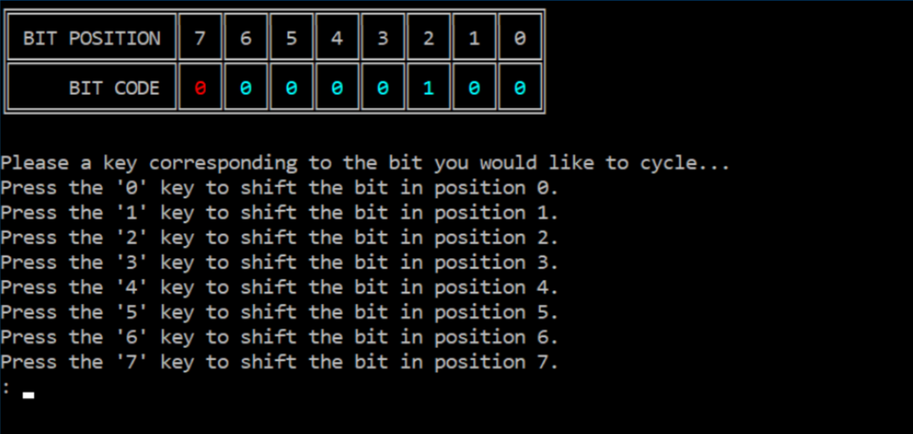

# asm_Bitflip

This was an assignment for college where I had to build an Assembly program that switched eflags between true and false. While doing so, the 0's and 1's were to cycle through a color pattern.
Keeping this description minimal for my professors sake.
This program was written in 981 lines of Assembly code using the MASM (Microsoft's Macro Assembler) in Visual Studio Code.
The [Irvine library](http://asmirvine.com/gettingStartedVS2017/index.htm) must be installed in the same directory in order for this to run properly.

